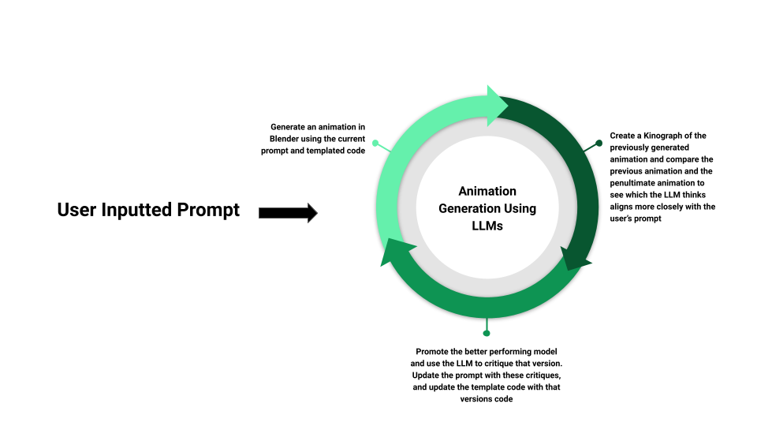

<html>
<head>
    <title>Embed Videos Side by Side with Autoplay</title>
    
</head>
<body>
    <h1>Animation Generation Using Large Language Models</h1>
    

        <a href="https://github.com/wfishell/BlenderCodeGeneration" style="margin-right: 10px;">Github Repo</a>
        <a href="KinographicPipeline.html" style="margin-right: 10px;">Kinographic Pipeline</a>
        <a href="CodeTemplate.html">Initial Code Template</a>
    

    

        

            <h2>Quilt Falling</h2>
            <video controls loop autoplay muted>
                <source src="QuiltFallingImprovedQuality.mp4" type="video/mp4">
                Your browser does not support the video tag.
            </video>
        

        

            <h2>Orbits</h2>
            <video controls loop autoplay muted>
                <source src="Orbits01Video.mp4" type="video/mp4">
                Your browser does not support the video tag.
            </video>
        

    

    <!-- Project Overview Section -->
    

        <h2>Project Overview</h2>
        

            We are using large language models to generate animations in Blender by prompting the LLM to generate code 
            which is used to create the animation. We have developed an iterative pipeline that generates an animation, 
            then passes the finished product back into the LLM. The LLM critiques the animation based on how accurately 
            it represents the inputted prompt and then provides an updated prompt along with the generated code for the 
            next iteration of animation. This process offers clear insights into how LLMs can critique their own work 
            and use that information to improve. It also provides interesting results in how LLMs transition from a prompt 
            to the 3D space, showcasing their ability to handle the complexity of spatial and temporal reasoning in 3D environments. Note that we render these animations at 256p X 256p to reduce the run time of rendering, but this process also outputs the blender file enabeling a user to render at a higher resolution if desired. We are using 4 templates to test the effectivesness of our pipeline:
            <li>Create me a python script for a blender animation of a ball bouncing</li>
            <li>Create me a python script for a blender animation of a quilt falling onto a sphere"</li>
            <li>Create me a python script for an object driving through a wall</li>
            <li>Create me a python script for a blender animation of a Planets orbitting around the Sun</li>
        

    

    

        <h2>Animation Generation Pipeline Issues</h2>
        
    

    <h1>Animation of Bouncing Balls Over Time</h1>
    

        

            <h3>Bouncing Balls Animation After 1 Iterations</h3>
            <video autoplay loop muted>
                <source src="BouncingBalls/BouncingBallso10.mp4" type="video/mp4">
                Your browser does not support the video tag.
            </video>
        

        

            <h3>Bouncing Balls Animation After 2 Iterations</h3>
            <video autoplay loop muted>
                <source src="BouncingBalls/BouncingBallso11.mp4" type="video/mp4">
                Your browser does not support the video tag.
            </video>
        

        

            <h3>Bouncing Balls Animation After 3 Iterations</h3>
            <video autoplay loop muted>
                <source src="BouncingBalls/BouncingBallso12.mp4" type="video/mp4">
                Your browser does not support the video tag.
            </video>
        

        

            <h3>Bouncing Balls Animation After 4 Iterations</h3>
            <video autoplay loop muted>
                <source src="BouncingBalls/BouncingBallso13.mp4" type="video/mp4">
                Your browser does not support the video tag.
            </video>
        

        

            <h3>Bouncing Balls Animation After 5 Iterations</h3>
            <video autoplay loop muted>
                <source src="BouncingBalls/BouncingBallso14.mp4" type="video/mp4">
                Your browser does not support the video tag.
            </video>
        

    

    

        <!-- Analysis Section -->
        <h2>Analysis</h2>
        

            This is a simple animation of balls bouncing. The LLM makes key decisions about the speed of how the ball bounces, 
            how it is distorted by the ground, and the complexity of the overall animation which create more realism. While there 
            is still much to be desired from this animation, there is a clear changes in each succesive animation which can be tied back to
            the feedback provided at each instance.
        

    

    

        <h2>Issues</h2>
        

            While this process has had success, there remain a few key issues with this framework that are creating difficulties with increasing the complexity in the animations generated:
            <li>There is randomness in the LLM's outputs which can cause variance in the output without any changes to the underlying code on our part. This is exemplified in instances of generating animations of orbits which vary from highly detailed animations to black screens because the camera was not initialized properly. </li>
            <li>The LLM often references functions and objects that don't exist. This causes errors which are fixed by recursively calling the function and passing in the failed code with the error to see if the LLM can fix itself. As the complexity of the prompt increases, the more the LLM tries to reference these nonexistent objects. We have specified a max recursive depth to prevent endless queries to the LLM but are still trying to figure out how to reduce these errors for more complex animations.</li>
        

    

